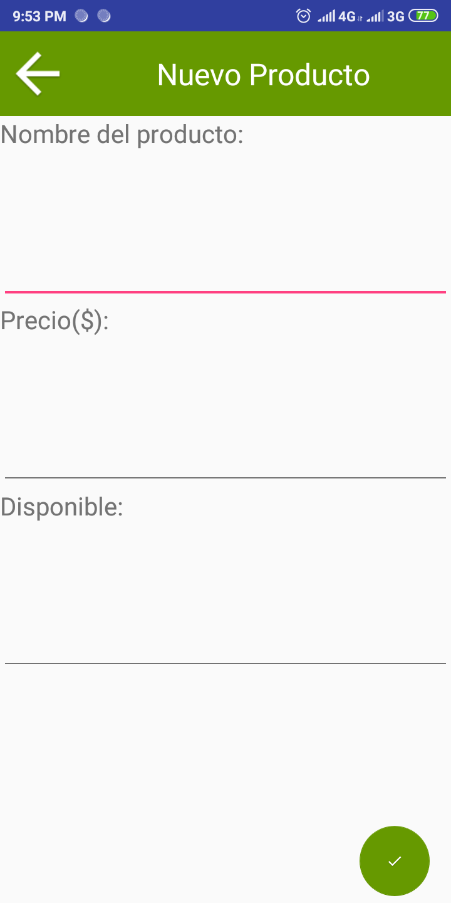
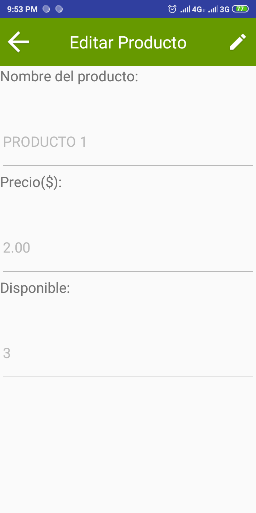
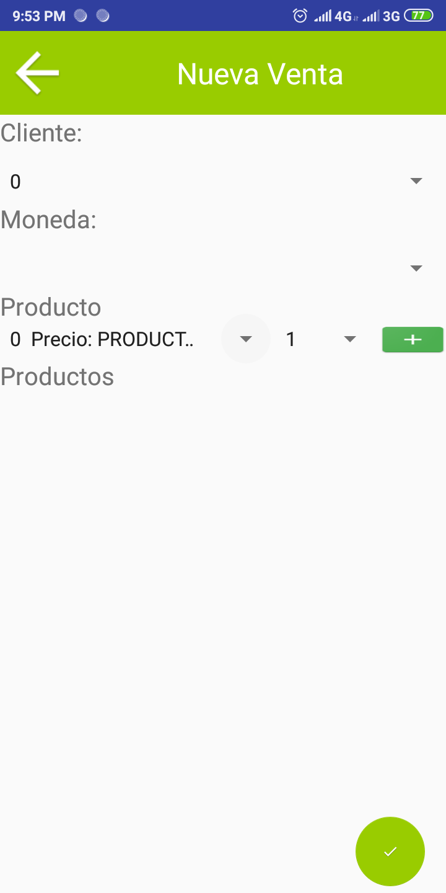
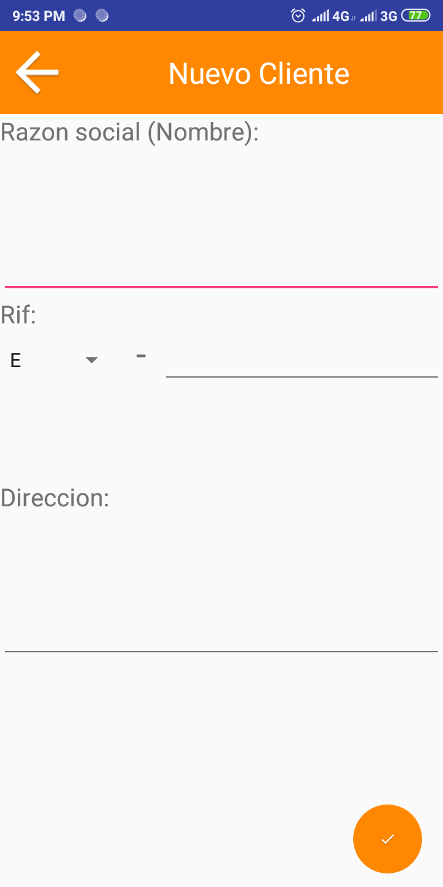
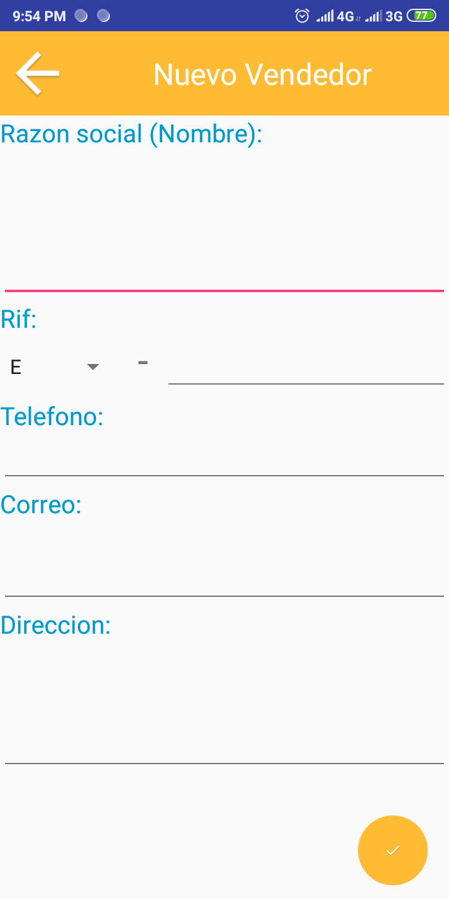
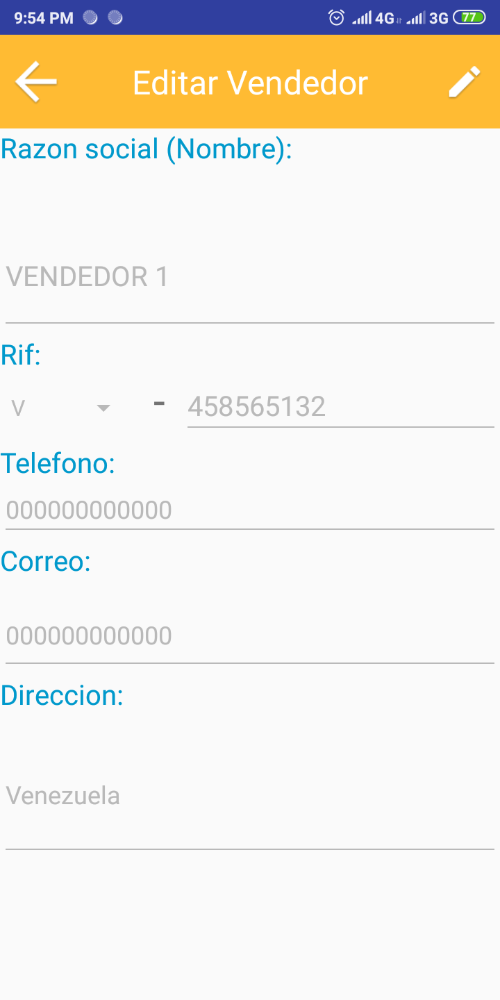
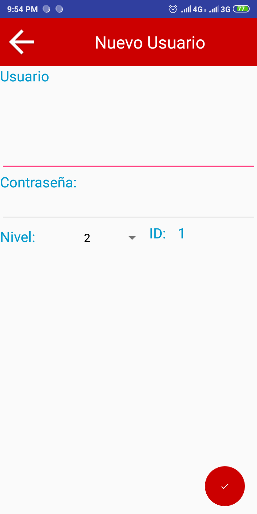

Android APP with SQLITE
# Used
- Android Studio
- Java
- SQLite
- Web Scrap
# Screenshots
<h4>Login</h4>

<h4>Menu</h4>

<h4>Inventario</h4>

<h4>Añadir al inventario</h4>

<h4>Editar en el inventario</h4>

<h4>Ventas</h4>

<h4>Añadir a las ventas</h4>

<h4>Clientes</h4>

<h4>Añadir a los clientes</h4>

<h4>Editar en los clientes</h4>

<h4>Vendedores</h4>

<h4>Añadir a los vendedores</h4>

<h4>Editar en los vendedores</h4>

<h4>Usuarios</h4>

<h4>Añadir a los usuarios</h4>

