Android APP with SQLITE
# Screenshots
- Login

- Menu
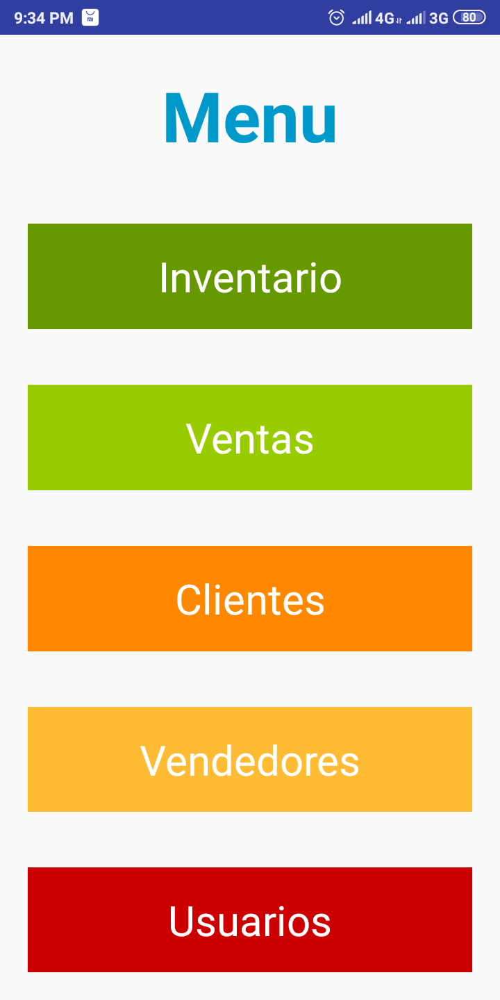
- Inventario
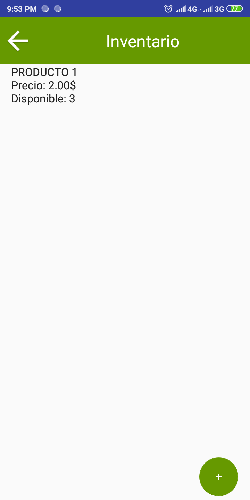
- Añadir al inventario
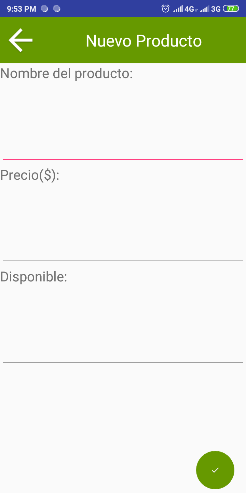
- Editar en el inventario
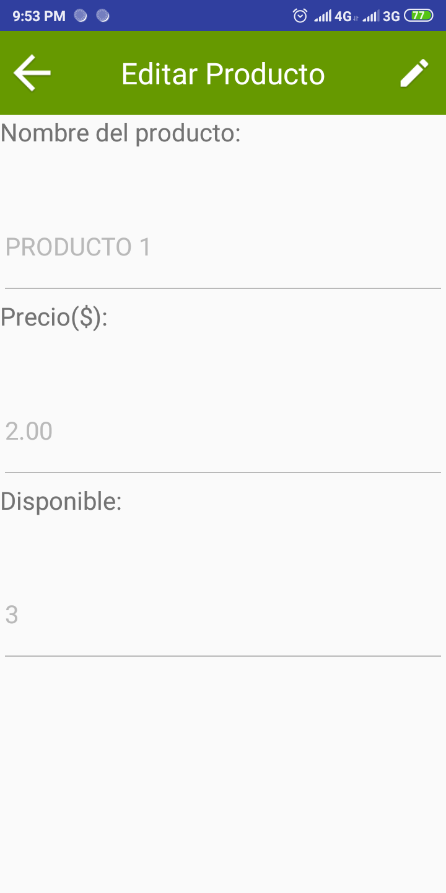
- Ventas

- Añadir a las ventas

- Clientes

- Añadir a los clientes
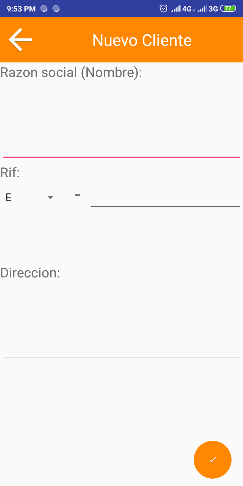
- Editar en los clientes
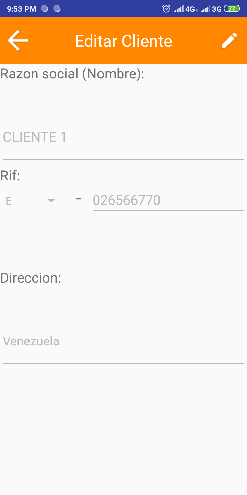
- Vendedores
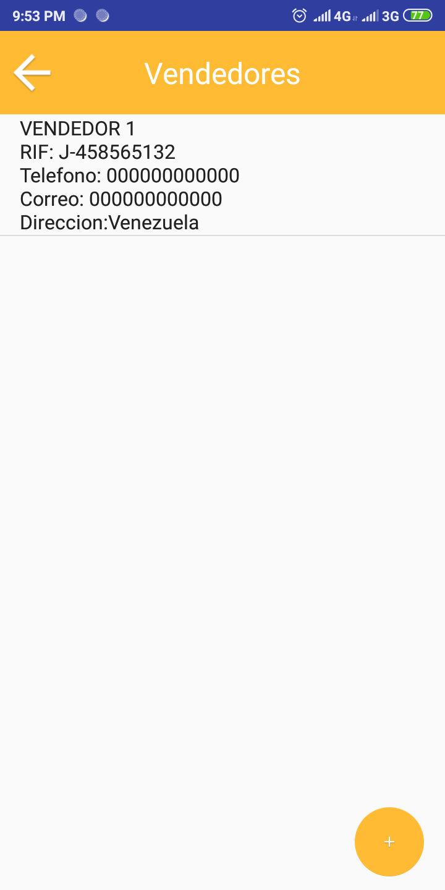
- Añadir a los vendedores
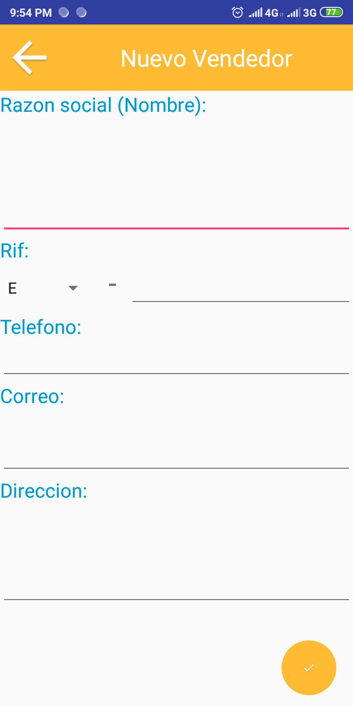
- Editar en los vendedores
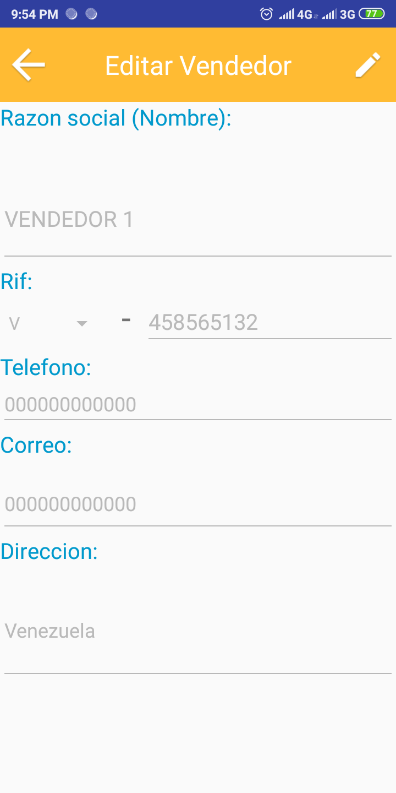
- Usuarios
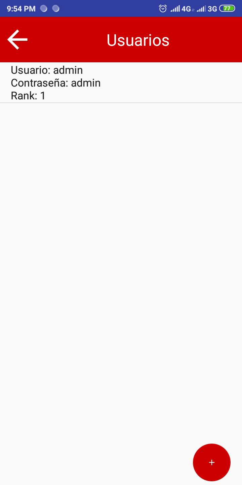
- Añadir a los usuarios
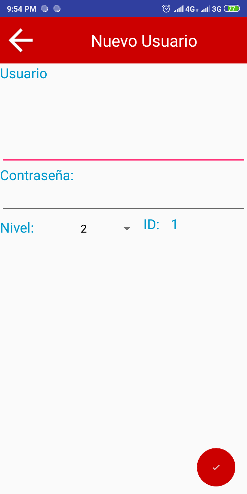
# Used
- Java
-SQLite

